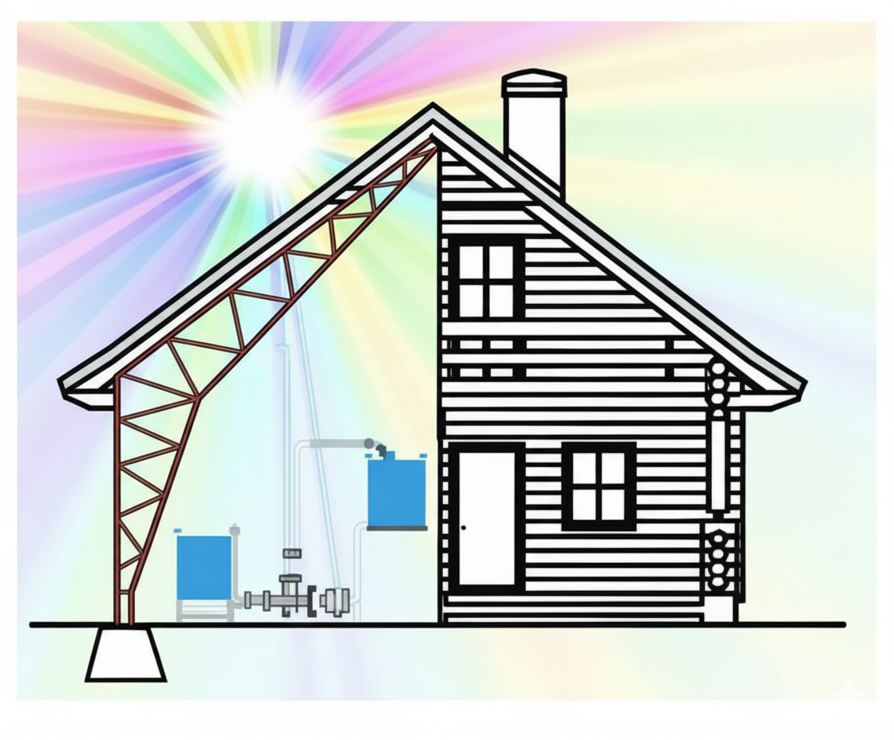

  # MECÁNICA EN LÍNEA – Sistema de Gestión de Taller

Plataforma web para la administración de talleres mecánicos pequeños, diseñada para centralizar la gestión de clientes, vehículos y cotizaciones en una única aplicación accesible desde cualquier dispositivo.
  <a href="https://github.com/Cookeing/taller_mecanico">
    
  </a>
---

## Descripción General

Este proyecto surge de la necesidad real de digitalizar la gestión de un taller mecánico, reemplazando el manejo manual de información (papeles, conversaciones de WhatsApp, registros dispersos) por una plataforma web organizada.

El sistema permite:

- Registrar clientes
- Asociar vehículos mediante patente
- Generar cotizaciones en PDF
- Adjuntar documentos e imágenes
- Consultar el historial completo de servicios

El objetivo es mejorar la organización del taller y facilitar el acceso a la información desde dispositivos móviles o computadoras.

---

## Funcionalidades

### Incluye

- Registro de clientes (nombre, RUT, teléfono)
- Registro de vehículos asociados a clientes
- Generación automática de cotizaciones en PDF
- Historial de servicios por vehículo
- Adjuntar boletas, facturas o imágenes
- Búsqueda rápida por cliente o patente
- Interfaz responsiva compatible con móviles

---

## Arquitectura

La aplicación sigue una arquitectura de tres capas basada en el patrón **MVT (Modelo-Vista-Template)**.

**Backend**

Desarrollado con Python utilizando el framework  
:contentReference[oaicite:1]{index=1}  
que gestiona la lógica de negocio y la interacción con la base de datos.


**Base de datos**

Se utiliza  
:contentReference[oaicite:2]{index=2}  
a través de  
:contentReference[oaicite:3]{index=3}  
para almacenar la información estructurada del sistema.

**Almacenamiento de archivos**

Supabase Storage se utiliza para guardar:

- PDFs de cotizaciones
- Facturas
- Imágenes de servicios

**Frontend**

La interfaz utiliza:

- HTML
- CSS
- JavaScript
- Bootstrap

servidos directamente desde Django mediante plantillas.

---

## Tecnologías utilizadas

- Python
- Django
- PostgreSQL
- Supabase
- HTML5
- CSS3
- JavaScript
- Bootstrap
- ReportLab (generación de PDFs)

---

## Estructura del proyecto

```
taller_mecanico/
│
├── clientes/
├── vehiculos/
├── cotizaciones/
│
├── templates/
├── static/
├── media/
│
├── manage.py
└── requirements.txt
```

---

## Instalación

Clonar el repositorio:

```
git clone https://github.com/Cookeing/taller_mecanico.git
```

Entrar al proyecto:

```
cd taller_mecanico
```

Instalar dependencias:

```
pip install -r requirements.txt
```

---

## Ejecución en desarrollo

```
python manage.py runserver
```

La aplicación estará disponible en:

```
http://127.0.0.1:8000/
```

---

## Funcionalidad de cotizaciones

El sistema permite registrar cotizaciones asociadas a clientes y vehículos.

Cada cotización incluye:

- Número de cotización
- Fecha
- Descripción del servicio
- Monto estimado
- Estado
- Cliente asociado
- Vehículo asociado

Las cotizaciones pueden exportarse automáticamente a **PDF** para su envío al cliente.

---

## Posibles integraciones futuras

- API de WhatsApp para envío automático de cotizaciones
- Integración con email
- Sistema multiusuario
- Gestión de inventario de repuestos

---

## Licencia

Este proyecto se distribuye bajo la licencia MIT.
